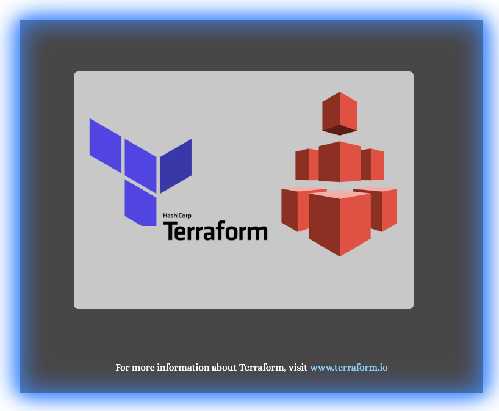
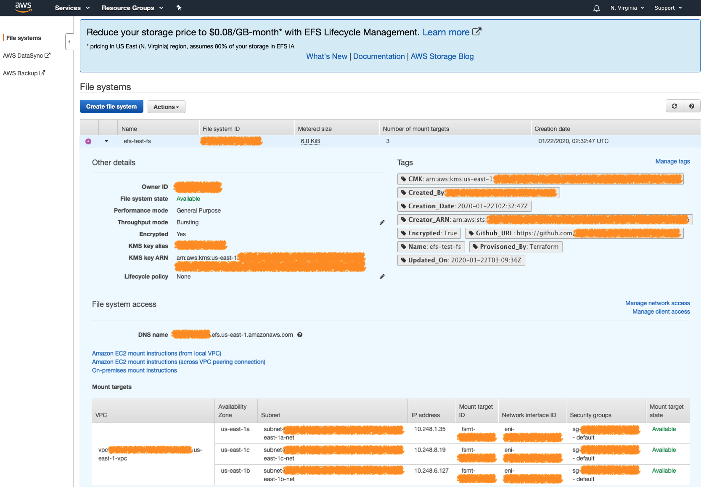

<!-- VSCode Markdown Exclusions-->
<!-- markdownlint-disable MD025 Single Title Headers-->
# Terraform EFS Module

  

<br>

# Getting Started

This Terraform module can quickly and easily provision an AWS EFS file system along with mount points to the provisioned files system for each availability zone referenced by the provided subnets defined in the efs_subnets variable during the module execution. EFS is a network-attached file system that can be accessed by multiple resources without the need to provide or manage individual file locks. It can be used in certain types of cluster configurations where several resources all need access to a shared file system. EFS uses NFS4 under the hood.

<br><br>

# Module Pre-Requisites and Dependencies

This module does not currently have any pre-requisites or dependency requirements.

<br><br>

# Module Usage

```terraform
module "demo_efs" {
  source = "git@github.com:CloudMage-TF/AWS-EFS-Module?ref=v1.0.0"

  // Required Variables
  efs_name             = "EFS-Test-FS"
  efs_subnets          = ["subnet-a123b456","subnet-c987d654"]
  
  // Optional Variables with module defined default values assigned
  # efs_performance_mode  = "generalPurpose"
  # efs_throughput_mode   = "bursting"
  # efs_throughput_value  = 0
  # efs_enable_encryption = false
  # efs_kms_key_arn       = "NULL"
  
  // Tags
  # efs_tags = {
  #   Provisoned_By  = "Terraform"
  #   GitHub_URL     = "https://github.com/CloudMage-TF/AWS-EFS-Module.git"
  # }
}
```

<br><br>

# Terraform Variables

Module variables that need to either be defined or re-defined with a non-default value can easily be hardcoded inline directly within the module call block or from within the root project that is consuming the module. If using the second approach then the root project must have it's own custom variables defined within the projects `variables.tf` file with set default values or with the values provided from a separate environmental `terraform.tfvar` file. Examples of both approaches can be found below. Note that for the standards used within this documentation, all variables will mostly use the first approach for ease of readability.

<br>

> __NOTE:__ There is also a third way to provide variable values using Terraform data sources. A data source is a unique type of code block used within a project that either instantiates or collects data that can be referenced throughout the project. A data source, for example,  can be declared to read the terraform state file and gather all of the available information from a previously deployed project stack. Any of the data contained within the data source can then be referenced to set the value of a project or module variable.

<br><br>

## Setting Variables Inline

```terraform
module "demo_efs" {
  source = "git@github.com:CloudMage-TF/AWS-EFS-Module?ref=v1.0.0"

  // Required Variables
  efs_name = "EFS-Test-FS"
}
```

<br><br>

## Setting Variables in a Terraform Root Project

<br>

### Terraform Root Project/variables.tf

```terraform
variable "shared_fs_name" {
  type        = string
  description = "Meaningful Description"
}
```

<br>

### Terraform Root Project/terraform.tfvars

```terraform
shared_fs_name = "EFS-Test-FS"
```

<br>

### Terraform Root Project/main.tf

```terraform
module "demo_efs" {
  source = "git@github.com:CloudMage-TF/AWS-EFS-Module?ref=v1.0.0"

  // Required Variables
  efs_name = var.shared_fs_name
}
```

<br><br>

# Required Variables

The following required module variables do not contain default values and must be set by the consumer of the module to use the module successfully.

<br><br>

## :red_circle: efs_name

<br>


<br>

This variable should be passed containing the unique name that will given to the provisioned EFS FileSystem.

<br>

> __NOTE:__ The provided value for the efs_name variable will be converted to all lower case during module execution.

<br><br>

### Declaration in module variables.tf

```terraform
variable "efs_name" {
  type        = string
  description = "Unique Name that will be assigned to the EFS File System being provisioned."
}
```

<br><br>

### Module usage in project root main.tf

```terraform
module "demo_efs" {
  source = "git@github.com:CloudMage-TF/AWS-EFS-Module?ref=v1.0.0"

  // Required Variables
  efs_name             = "EFS-Test-FS"
}
```

<br><br><br>

## :red_circle: efs_subnets

<br>


<br>

This variable will be used during the EFS file system creation process to set the subnets or Availability Zones that the EFS file system will create mount points that can be used by other resources that live in those subnets or AZ's. The variable should be a list of strings that contains __a minimum of 1 configured subnet__ although it is advisable to set multiple subnets in case of an Availability Zone outage. Also, the provided list items __MUST__ be in the valid Subnet Id format, such as `subnet-a123b456`. If the VPC that EFS is being deployed into was created using a previously deployed Terraform project root, then the value of this variable can be set using a data source instead of setting a hardcoded Subnet list value.

<br><br>

### Declaration in module variables.tf

```terraform
variable "efs_subnets" {
  type        = list(string)
  description = "Specify a list of Subnet Ids where EFS mount points for the provisioned EFS FileSystem should be created."
  default     = []
}
```

<br><br>

### Module usage in project root main.tf

```terraform
module "demo_efs" {
  source = "git@github.com:CloudMage-TF/AWS-EFS-Module?ref=v1.0.0"

  // Required Variables
  efs_name             = "EFS-Test-FS"
  efs_subnets          = ["subnet-a123b456","subnet-c987d654"]
}
```

<br><br>

### Module usage in project root main.tf using a datasource

```terraform
// Get Account VPC State
data "terraform_remote_state" "vpc" {
  backend   = "s3"
  workspace = terraform.workspace

  config = {
    region = var.vpc_state_region
    bucket = var.vpc_state_bucket_name
    key    = var.vpc_state_key
  }
}

module "demo_efs" {
  source = "git@github.com:CloudMage-TF/AWS-EFS-Module?ref=v1.0.0"

  // Required Variables
  efs_name             = "EFS-Test-FS"
  efs_subnets          = data.terraform_remote_state.vpc.outputs.private_subnets
}
```

<br><br><br>

## Base Module Execution

Once all of the modules required values have been assigned, then the module can be executed in its base capacity.

<br><br>

### Example `terraform plan` output

```terraform
Refreshing Terraform state in-memory prior to plan...
The refreshed state will be used to calculate this plan, but will not be
persisted to local or remote state storage.

data.terraform_remote_state.vpc: Refreshing state...
module.demo_efs.data.aws_caller_identity.current: Refreshing state...

------------------------------------------------------------------------

An execution plan has been generated and is shown below.
Resource actions are indicated with the following symbols:
  + create

Terraform will perform the following actions:

  # module.demo_efs.aws_efs_file_system.this will be created
  + resource "aws_efs_file_system" "this" {
      + arn              = (known after apply)
      + creation_token   = "EFS-Test-FS"
      + dns_name         = (known after apply)
      + encrypted        = false
      + id               = (known after apply)
      + kms_key_id       = (known after apply)
      + performance_mode = "generalPurpose"
      + reference_name   = (known after apply)
      + tags             = (known after apply)
      + throughput_mode  = "bursting"
    }

  # module.demo_efs.aws_efs_mount_target.this[0] will be created
  + resource "aws_efs_mount_target" "this" {
      + dns_name             = (known after apply)
      + file_system_arn      = (known after apply)
      + file_system_id       = (known after apply)
      + id                   = (known after apply)
      + ip_address           = (known after apply)
      + network_interface_id = (known after apply)
      + security_groups      = (known after apply)
      + subnet_id            = "subnet-012abc3d4e5d67890"
    }

  # module.demo_efs.aws_efs_mount_target.this[1] will be created
  + resource "aws_efs_mount_target" "this" {
      + dns_name             = (known after apply)
      + file_system_arn      = (known after apply)
      + file_system_id       = (known after apply)
      + id                   = (known after apply)
      + ip_address           = (known after apply)
      + network_interface_id = (known after apply)
      + security_groups      = (known after apply)
      + subnet_id            = "subnet-0123abc456de78910"
    }

  # module.demo_efs.aws_efs_mount_target.this[2] will be created
  + resource "aws_efs_mount_target" "this" {
      + dns_name             = (known after apply)
      + file_system_arn      = (known after apply)
      + file_system_id       = (known after apply)
      + id                   = (known after apply)
      + ip_address           = (known after apply)
      + network_interface_id = (known after apply)
      + security_groups      = (known after apply)
      + subnet_id            = "subnet-9876edc543ba21098"
    }

Plan: 4 to add, 0 to change, 0 to destroy.

------------------------------------------------------------------------

Note: You didn't specify an "-out" parameter to save this plan, so Terraform
can't guarantee that exactly these actions will be performed if
"terraform apply" is subsequently run.
```

<br><br><br>

# Optional Variables

The following optional module variables are not required because they already have default values assigned when the variables where defined within the modules `variables.tf` file. If the default values do not need to be changed by the root project consuming the module, then they do not even need to be included in the root project. If any of the variables do need to be changed, then they can be added to the root project in the same way that the required variables were defined and utilized. Optional variables also may alter how the module provisions resources in the cases of encryption or IAM policy generation. A variable could flag an encryption requirement when provisioning an S3 bucket or Dynamo table by providing a KMS CMK, for example. Another use case may be the passage of ARN values to allow users or roles access to services or resources, whereas by default permissions would be more restrictive or only assigned to the account root or a single IAM role. A detailed explanation of each of this modules optional variables can be found below:

<br><br>

## :large_blue_circle: efs_performance_mode

<br>


<br>

This variable is used to select the performance mode of the EFS file system that will be provisioned. The value assigned to the variable must be either `generalPurpose` or `maxIO`. A high-level description of the two selectable options is listed below in order to read about EFS performance in-depth [visit docs.aws.amazon.com](https://docs.aws.amazon.com/efs/latest/ug/performance.html).

- __generalPurpose__ - Default mode used for the majority of EFS file systems. Ideal for latency-sensitive use cases and general file serving.
- __maxIO__ - Can scale to higher throughput and more operations per second with a trade off of slightly higher latency.

<br>

> __Note:__ Once the EFS file system has been provisioned with a set performance mode, it can not be changed without re-provisioning the entire file system.

<br><br>

### Declaration in module variables.tf

```terraform
variable "efs_performance_mode" {
  type        = string
  description = "Specify the desired EFS file system performance mode. Valid values can be either 'generalPurpose' or 'maxIO'. Default set to 'generalPurpose'"
  default     = "generalPurpose"
}
```

<br><br>

### Module usage in project root main.tf

```terraform
module "demo_efs" {
  source = "git@github.com:CloudMage-TF/AWS-EFS-Module?ref=v1.0.0"

  // Required Variables
  efs_name             = "EFS-Test-FS"
  efs_subnets          = ["subnet-a123b456","subnet-c987d654"]
  efs_performance_mode = "maxIO"
}
```

<br><br>

### Example `terraform plan` output

```terraform
Refreshing Terraform state in-memory prior to plan...
The refreshed state will be used to calculate this plan, but will not be
persisted to local or remote state storage.

data.terraform_remote_state.vpc: Refreshing state...
module.demo_efs.data.aws_caller_identity.current: Refreshing state...

------------------------------------------------------------------------

An execution plan has been generated and is shown below.
Resource actions are indicated with the following symbols:
  + create

Terraform will perform the following actions:

  # module.demo_efs.aws_efs_file_system.this will be created
  + resource "aws_efs_file_system" "this" {
      + arn              = (known after apply)
      + creation_token   = "EFS-Test-FS"
      + dns_name         = (known after apply)
      + encrypted        = false
      + id               = (known after apply)
      + kms_key_id       = (known after apply)
      + performance_mode = "maxIO"
      + reference_name   = (known after apply)
      + tags             = (known after apply)
      + throughput_mode  = "bursting"
    }

  # module.demo_efs.aws_efs_mount_target.this[0] will be created
  + resource "aws_efs_mount_target" "this" {
      + dns_name             = (known after apply)
      + file_system_arn      = (known after apply)
      + file_system_id       = (known after apply)
      + id                   = (known after apply)
      + ip_address           = (known after apply)
      + network_interface_id = (known after apply)
      + security_groups      = (known after apply)
      + subnet_id            = "subnet-012abc3d4e5d67890"
    }

  # module.demo_efs.aws_efs_mount_target.this[1] will be created
  + resource "aws_efs_mount_target" "this" {
      + dns_name             = (known after apply)
      + file_system_arn      = (known after apply)
      + file_system_id       = (known after apply)
      + id                   = (known after apply)
      + ip_address           = (known after apply)
      + network_interface_id = (known after apply)
      + security_groups      = (known after apply)
      + subnet_id            = "subnet-0123abc456de78910"
    }

  # module.demo_efs.aws_efs_mount_target.this[2] will be created
  + resource "aws_efs_mount_target" "this" {
      + dns_name             = (known after apply)
      + file_system_arn      = (known after apply)
      + file_system_id       = (known after apply)
      + id                   = (known after apply)
      + ip_address           = (known after apply)
      + network_interface_id = (known after apply)
      + security_groups      = (known after apply)
      + subnet_id            = "subnet-9876edc543ba21098"
    }

Plan: 4 to add, 0 to change, 0 to destroy.

------------------------------------------------------------------------

Note: You didn't specify an "-out" parameter to save this plan, so Terraform
can't guarantee that exactly these actions will be performed if
"terraform apply" is subsequently run.
```

<br><br><br>

## :large_blue_circle: efs_throughput_mode

<br>


<br>

This variable is used to select the throughput mode of the EFS file system that will be provisioned. The value assigned to the variable must be either `bursting` or `provisioned`. A high-level description of the two selectable options is listed below in order to read about EFS throughput in-depth [visit docs.aws.amazon.com](https://docs.aws.amazon.com/efs/latest/ug/performance.html).

- __bursting__ - Recommended default throughput mode used for the majority of EFS file systems. Typical throughput is 50 MiB/s per TiB of storage, with a burst rate of up to 100MiB/s for a duration specified to the amount of burst credit available.
- __provisioned__ - Available for applications with high throughput to storage requirements. Range can be selected from 1MiB/s up to 1024MiB/s, at the additional cost of roughly $6.00 per 1MiB allocated.

<br>

> __Note:__ Provisioned EFS file systems can be changed from bursting mode to provisioned mode and vise versa once every 24 hours. If the throughput mode was changed less then 24 hour previously the change attempt will fail.

<br><br>

### Declaration in module variables.tf

```terraform
variable "efs_throughput_mode" {
  type        = string
  description = "Specify the desired EFS throughput mode. Valid values can be either 'bursting' or 'provisioned'. Default set to 'bursting'"
  default     = "bursting"
}
```

<br><br>

### Module usage in project root main.tf

```terraform
module "demo_efs" {
  source = "git@github.com:CloudMage-TF/AWS-EFS-Module?ref=v1.0.0"

  // Required Variables
  efs_name             = "EFS-Test-FS"
  efs_subnets          = ["subnet-a123b456","subnet-c987d654"]
  efs_throughput_mode  = "provisioned"

  // Optional Variables with module defined default values assigned
  # efs_performance_mode  = "generalPurpose"
}
```

<br>

> __NOTE:__ If setting the EFS file system throughput mode to `provisioned`, the value for the desired throughput must also be set. The desired throughput value can be set using the `efs_throughput_value` variable and must be set to a valid number between the range of 1 and 1025 representing the desired MiB/s throughput rate.

<br><br><br>

## :large_blue_circle: efs_throughput_value

<br>


<br>

This variable is used to set the desired throughput rate when the EFS throughput mode is set to. `provisioned`. Valid values for the provisioned throughput range between 1 and 1024 and represent the MiB/s of throughput that will be allocated and assigned to the provisioned EFS file system.

<br>

> __Note:__ Setting the throughput mode to provisioned comes with additional pricing that averages roughly $6.00 per 1 MiB/s selected. Be sure to calculate the cost prior to provisioning the EFS file system in provisioned throughput mode.

<br><br>

### Declaration in module variables.tf

```terraform
variable "efs_throughput_value" {
  type        = number
  description = "Specify the desired EFS throughput value in MiB. This Variable is required if efs_throughput_mode is set to provisioned. Valid value range is 1-1024. Note that there are additional costs for using EFS provisioned throughput mode."
  default     = 0
}
```

<br><br>

### Module usage in project root main.tf

```terraform
module "demo_efs" {
  source = "git@github.com:CloudMage-TF/AWS-EFS-Module?ref=v1.0.0"

  // Required Variables
  efs_name             = "EFS-Test-FS"
  efs_subnets          = ["subnet-a123b456","subnet-c987d654"]
  efs_throughput_mode  = "provisioned"
  efs_throughput_value = 10

  // Optional Variables with module defined default values assigned
  # efs_performance_mode  = "generalPurpose"
}
```

<br>

> __NOTE:__ This variable is only valid and used when used when setting the `efs_throughput_mode` to `provisioned`.

<br><br>

### Example `terraform plan` output

```terraform
Refreshing Terraform state in-memory prior to plan...
The refreshed state will be used to calculate this plan, but will not be
persisted to local or remote state storage.

data.terraform_remote_state.vpc: Refreshing state...
module.demo_efs.data.aws_caller_identity.current: Refreshing state...

------------------------------------------------------------------------

An execution plan has been generated and is shown below.
Resource actions are indicated with the following symbols:
  + create

Terraform will perform the following actions:

  # module.demo_efs.aws_efs_file_system.this will be created
  + resource "aws_efs_file_system" "this" {
      + arn                             = (known after apply)
      + creation_token                  = "EFS-Test-FS"
      + dns_name                        = (known after apply)
      + encrypted                       = false
      + id                              = (known after apply)
      + kms_key_id                      = (known after apply)
      + performance_mode                = "generalPurpose"
      + provisioned_throughput_in_mibps = 10
      + reference_name                  = (known after apply)
      + tags                            = (known after apply)
      + throughput_mode                 = "provisioned"
    }

  # module.demo_efs.aws_efs_mount_target.this[0] will be created
  + resource "aws_efs_mount_target" "this" {
      + dns_name             = (known after apply)
      + file_system_arn      = (known after apply)
      + file_system_id       = (known after apply)
      + id                   = (known after apply)
      + ip_address           = (known after apply)
      + network_interface_id = (known after apply)
      + security_groups      = (known after apply)
      + subnet_id            = "subnet-012abc3d4e5d67890"
    }

  # module.demo_efs.aws_efs_mount_target.this[1] will be created
  + resource "aws_efs_mount_target" "this" {
      + dns_name             = (known after apply)
      + file_system_arn      = (known after apply)
      + file_system_id       = (known after apply)
      + id                   = (known after apply)
      + ip_address           = (known after apply)
      + network_interface_id = (known after apply)
      + security_groups      = (known after apply)
      + subnet_id            = "subnet-0123abc456de78910"
    }

  # module.demo_efs.aws_efs_mount_target.this[2] will be created
  + resource "aws_efs_mount_target" "this" {
      + dns_name             = (known after apply)
      + file_system_arn      = (known after apply)
      + file_system_id       = (known after apply)
      + id                   = (known after apply)
      + ip_address           = (known after apply)
      + network_interface_id = (known after apply)
      + security_groups      = (known after apply)
      + subnet_id            = "subnet-9876edc543ba21098"
    }

Plan: 4 to add, 0 to change, 0 to destroy.

------------------------------------------------------------------------

Note: You didn't specify an "-out" parameter to save this plan, so Terraform
can't guarantee that exactly these actions will be performed if
"terraform apply" is subsequently run.
```

<br><br><br>

## :large_blue_circle: efs_enable_encryption

<br>


<br>

This variable is used to enable encryption on the EFS file system being provisioned. This variable must be a bool value of either `true` or `false`. True will enable encryption on the EFS file system during provisioning, while false will produce an unencrypted file system. This variable can be used in conjunction with the `efs_kms_key_arn` variable in order to specify the KMS CMK that will be used to encrypt the file system. If no CMK is provided then, EFS will be provisioned using the default AWS managed KMS key.

<br><br>

### Declaration in module variables.tf

```terraform
variable "efs_enable_encryption" {
  type        = bool
  description = "Flag to enable EFS FileSystem encryption."
  default     = false
}
```

<br><br>

### Module usage in project root main.tf

```terraform
module "demo_efs" {
  source = "git@github.com:CloudMage-TF/AWS-EFS-Module?ref=v1.0.0"

  // Required Variables
  efs_name               = "EFS-Test-FS"
  efs_subnets            = ["subnet-a123b456","subnet-c987d654"]
  efs_enable_encryption  = true
  
  // Optional Variables with module defined default values assigned
  # efs_performance_mode  = "generalPurpose"
  # efs_throughput_mode   = "bursting"
  # efs_throughput_value  = 0
}
```

<br><br><br>

## :large_blue_circle: efs_kms_key_arn

<br>


<br>

This variable is used to specify the KMS CMK that will be used to encrypt the EFS file system that will be provisioned. If specifying this variable, then `efs_enable_encryption` <mark>MUST</mark> also be set to true. If this variable is not provided and encryption is enabled, then EFS will use the default AWS managed KMS key to encrypt the file system. The value of this variable must contain a valid KMS CMK ARN.

<br><br>

### Declaration in module variables.tf

```terraform
variable "efs_kms_key_arn" {
  type        = string
  description = "The key that will be used to encrypt the EFS FileSystem. If the default value of AES256 is unchanged, S3 will encrypt objects with the default KMS key. If a KMS CMK ARN is provided, then S3 will encrypt objects with the specified KMS key instead."
  default     = "NULL"
}
```

<br><br>

### Module usage in project root main.tf

```terraform
module "demo_efs" {
  source = "git@github.com:CloudMage-TF/AWS-EFS-Module?ref=v1.0.0"

  // Required Variables
  efs_name               = "EFS-Test-FS"
  efs_subnets            = ["subnet-a123b456","subnet-c987d654"]
  efs_enable_encryption  = true
  efs_kms_key_arn        = "arn:aws:kms:us-east-1:111122223333:key/1234abcd-12ab-34cd-56ef-1234567890ab"
  
  // Optional Variables with module defined default values assigned
  # efs_performance_mode  = "generalPurpose"
  # efs_throughput_mode   = "bursting"
  # efs_throughput_value  = 0
}
```

<br><br>

### Example `terraform plan` output

```terraform
Refreshing Terraform state in-memory prior to plan...
The refreshed state will be used to calculate this plan, but will not be
persisted to local or remote state storage.

data.terraform_remote_state.vpc: Refreshing state...
module.demo_efs.data.aws_caller_identity.current: Refreshing state...

------------------------------------------------------------------------

An execution plan has been generated and is shown below.
Resource actions are indicated with the following symbols:
  + create

Terraform will perform the following actions:

  # module.demo_efs.aws_efs_file_system.this will be created
  + resource "aws_efs_file_system" "this" {
      + arn              = (known after apply)
      + creation_token   = "EFS-Test-FS"
      + dns_name         = (known after apply)
      + encrypted        = true
      + id               = (known after apply)
      + kms_key_id       = "arn:aws:kms:us-east-1:111122223333:key/1234abcd-12ab-34cd-56ef-1234567890ab"
      + performance_mode = "generalPurpose"
      + reference_name   = (known after apply)
      + tags             = (known after apply)
      + throughput_mode  = "bursting"
    }

  # module.demo_efs.aws_efs_mount_target.this[0] will be created
  + resource "aws_efs_mount_target" "this" {
      + dns_name             = (known after apply)
      + file_system_arn      = (known after apply)
      + file_system_id       = (known after apply)
      + id                   = (known after apply)
      + ip_address           = (known after apply)
      + network_interface_id = (known after apply)
      + security_groups      = (known after apply)
      + subnet_id            = "subnet-012abc3d4e5d67890"
    }

  # module.demo_efs.aws_efs_mount_target.this[1] will be created
  + resource "aws_efs_mount_target" "this" {
      + dns_name             = (known after apply)
      + file_system_arn      = (known after apply)
      + file_system_id       = (known after apply)
      + id                   = (known after apply)
      + ip_address           = (known after apply)
      + network_interface_id = (known after apply)
      + security_groups      = (known after apply)
      + subnet_id            = "subnet-0123abc456de78910"
    }

  # module.demo_efs.aws_efs_mount_target.this[2] will be created
  + resource "aws_efs_mount_target" "this" {
      + dns_name             = (known after apply)
      + file_system_arn      = (known after apply)
      + file_system_id       = (known after apply)
      + id                   = (known after apply)
      + ip_address           = (known after apply)
      + network_interface_id = (known after apply)
      + security_groups      = (known after apply)
      + subnet_id            = "subnet-9876edc543ba21098"
    }

Plan: 4 to add, 0 to change, 0 to destroy.

------------------------------------------------------------------------

Note: You didn't specify an "-out" parameter to save this plan, so Terraform
can't guarantee that exactly these actions will be performed if
"terraform apply" is subsequently run.
```

<br><br><br>

## :large_blue_circle: efs_tags

<br>


<br>

This variable should contain a map of tags that will be assigned to the EFS file system upon creation. Any tags contained within the `efs_tags` map variable will be passed to the module and automatically merged with a few tags that are also automatically created when the module is executed. The automatically generated tags are as follows:

- __Name__ - This tag is assigned the value from the `efs_name` variable tha is passed in during module execution
- __Created_By__ - This tag is assigned the value of the aws user that was used to execute the Terraform module to create the EFS file system. It uses the Terraform `aws_caller_identity {}` data source provider to obtain the User_Id value. This tag will be ignored for any future executions of the module, ensuring that its value will not be changed after it's initial creation.
- __Creator_ARN__ - This tag is assigned the ARN value of the aws user that was used to execute the Terraform module to create the EFS file system. It uses the Terraform `aws_caller_identity {}` data source provider to obtain the User_ARN value. This tag will be ignored for any future executions of the module, ensuring that its value will not be changed after it's initial creation.
- __Creation_Date__ - This tag is assigned a value that is obtained by the Terraform `timestamp()` function. This tag will be ignored for any future executions of the module, ensuring that its value will not be changed after it's initial creation.
- __Updated_On__ - This tag is assigned a value that is obtained by the Terraform `timestamp()` function. This tag will be updated on each future execution of the module to ensure that it's value displays the last `terraform apply` date.
- __Encrypted__ - This tag is assigned the value from the `efs_enable_encryption` variable. If the consumer of the module did not flag the encryption option, then by default the value of the efs_enable_encryption variable is set to `false`.
- __CMK_ARN__ - This tag is assigned the value from the `efs_kms_key_arn` variable if provisioning an encrypted EFS file system. If the EFS file system is not encrypted this tag will be excluded.

<br><br>

### Declaration in module variables.tf

```terraform
variable "efs_tags" {
  type        = map
  description = "Specify any tags that should be added to the EFS FileSystem being provisioned."
  default     = {
    Provisoned_By      = "Terraform"
    Module_GitHub_URL  = "https://github.com/CloudMage-TF/AWS-EFS-Module.git"
  }
}
```

<br><br>

### Module usage in project root main.tf

```terraform
module "demo_efs" {
  source = "git@github.com:CloudMage-TF/AWS-EFS-Module?ref=v1.0.0"

  // Required Variables
  efs_name               = "EFS-Test-FS"
  efs_subnets            = ["subnet-a123b456","subnet-c987d654"]
  
  // Tags
  efs_tags = {
     Provisoned_By     = "Terraform"
     Module_GitHub_URL = "https://github.com/CloudMage-TF/AWS-EFS-Module.git"
     Encrypted         = "True"
     CMK               = "arn:aws:kms:us-east-1:111122223333:key/1234abcd-12ab-34cd-56ef-1234567890ab"
   }
  
  // Optional Variables with module defined default values assigned
  # efs_performance_mode   = "generalPurpose"
  # efs_throughput_mode    = "bursting"
  # efs_throughput_value   = 0
  # efs_enable_encryption  = false
  # efs_kms_key_arn        = "NULL"
}
```

<br><br>



<br><br>

# Module Example Usage

An example of how to use this module can be found within the `example` directory of this repository

<br><br>

# Variables and TFVars File Templates

The following code block can be used or appended to an existing tfvars file within the project root consuming this module. Optional Variables are commented out and have their values set to the default values defined in the modules variables.tf file. If the values do not need to be changed, then they do not need to be redefined in the project root. If they do need to be changed, then include them in the root project and change the values accordingly.

<br><br>

## Complete Module variables.tf File

```terraform
###########################################################################
# Required EFS Module Vars:                                               #
#-------------------------------------------------------------------------#
# The following variables require consumer defined values to be provided. #
###########################################################################
variable "efs_name" {
  type        = string
  description = "Unique Name that will be assigned to the EFS File System being provisioned."
}
variable "efs_subnets" {
  type        = list(string)
  description = "Specify a list of Subnet Ids where EFS mount points for the provisioned EFS FileSystem should be created."
  default     = []
}


###########################################################################
# Optional EFS Module Vars:                                               #
#-------------------------------------------------------------------------#
# The following variables have default values already set by the module.  #
# They will not need to be included in a project root module variables.tf #
# file unless a non-default value needs be assigned to the variable.      #
###########################################################################
variable "efs_performance_mode" {
  type        = string
  description = "Specify the desired EFS file system performance mode. Valid values can be either 'generalPurpose' or 'maxIO'. Default set to 'generalPurpose'"
  default     = "generalPurpose"
}

variable "efs_throughput_mode" {
  type        = string
  description = "Specify the desired EFS throughput mode. Valid values can be either 'bursting' or 'provisioned'. Default set to 'bursting'"
  default     = "bursting"
}

variable "efs_throughput_value" {
  type        = number
  description = "Specify the desired EFS throughput value in MiB. This Variable is required if efs_throughput_mode is set to provisioned. Valid value range is 1-1024. Note that there are additional costs for using EFS provisioned throughput mode."
  default     = 0
}

variable "efs_enable_encryption" {
  type        = bool
  description = "Flag to enable EFS FileSystem encryption."
  default     = false
}

variable "efs_kms_key_arn" {
  type        = string
  description = "The key that will be used to encrypt the EFS FileSystem. If the default value of AES256 is unchanged, S3 will encrypt objects with the default KMS key. If a KMS CMK ARN is provided, then S3 will encrypt objects with the specified KMS key instead."
  default     = "NULL"
}

variable "efs_tags" {
  type        = map
  description = "Specify any tags that should be added to the EFS FileSystem being provisioned."
  default     = {
    Provisoned_By  = "Terraform"
    Module_GitHub_URL     = "https://github.com/CloudMage-TF/AWS-EFS-Module.git"
  }
}
```

<br><br>

## Complete Module TFVars File

```terraform
###########################################################################
# Required EFS Module Vars:                                               #
#-------------------------------------------------------------------------#
# The following variables require consumer defined values to be provided. #
###########################################################################
efs_name          = "Value Required"
efs_subnets       = ["subnet-12345678"]


###########################################################################
# Optional EFS Module Vars:                                               #
#-------------------------------------------------------------------------#
# The following variables have default values already set by the module.  #
# They will not need to be included in a project root module variables.tf #
# file unless a non-default value needs be assigned to the variable.      #
###########################################################################
efs_performance_mode    = "generalPurpose"
efs_throughput_mode     = "bursting"
efs_throughput_value    = 0
efs_enable_encryption   = false
efs_kms_key_arn         = "NULL"
efs_tags                = {
    Provisoned_By       = "Terraform"
    Module_GitHub_URL   = "https://github.com/CloudMage-TF/AWS-EFS-Module.git"
}
```

<br><br>

# Module Outputs

The template will finally create the following outputs that can be pulled and used in subsequent terraform runs via data sources. The outputs will be written to the Terraform state file.

<br>

```terraform
#############################
# EFS File System Outputs:  #
#############################
output "efs_id" {}
output "efs_arn" {}
output "efs_dns_name" {}

##############################
# EFS Mount Points Outputs:  #
##############################
output "efs_mount_id" {}
output "efs_mount_arn" {}
output "efs_mount_dns_name" {}
output "efs_mount_eni" {}
```

<br><br>

# Module Output Usage

When using and calling the module within a root project, the output values of the module are available to the project root by simply referencing the module outputs from the root project `outputs.tf` file.

<br>

```terraform
############################
# EFS File System Outputs: #
############################
output "efs_id" {
  value = module.demo_efs.efs_id
}

output "efs_arn" {
  value = module.demo_efs.efs_arn
}

output "efs_dns_name" {
  value = module.demo_efs.efs_dns_name
}

#############################
# EFS Mount Points Outputs: #
#############################
output "efs_mount_id" {
  value = module.demo_efs.*.efs_mount_id
}

output "efs_mount_arn" {
  value = module.demo_efs.*.efs_mount_arn
}

output "efs_mount_dns_name" {
  value = module.demo_efs.*.efs_mount_dns_name
}

output "efs_mount_eni" {
  value = module.demo_efs.*.efs_mount_eni
}
```

<br>

> __Note:__ When referencing the module outputs be sure that the output value contains the identifier given to the module call. As an example if the module was defined as `module "efs_mount_eni" {}` then the output reference would be constructed as `module.efs_mount_eni.efs_arn`.

# Requirements

- [Terraform](https://www.terraform.io/)
- [GIT](https://git-scm.com/download/win)
- [AWS-Account](https://https://aws.amazon.com/)

<br><br>

# Recommended

- [Terraform for VSCode](https://github.com/mauve/vscode-terraform)
- [Terraform Config Inspect](https://github.com/hashicorp/terraform-config-inspect)

<br><br>

# Contacts and Contributions

This project is owned by [CloudMage](rnason@cloudmage.io).

To contribute, please:

- Fork the project
- Create a local branch
- Submit Changes
- Create A Pull Request
